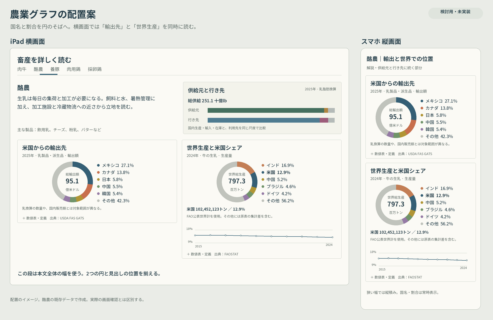

# 北米農業：円グラフのラベル集約・iPad横画面の比較配置 設計書 v7.1

| 項目 | 内容 |
|---|---|
| 作成日 | 2026年9月14日 |
| 対象 | Insight Journal／B07 日経開発：農業 |
| 状態 | 配置案の合意を受けた実装用設計。v7.1の画面変更は未実装 |
| 基準main | `7d4cbac49b66b8fca558cab3ee64e7d022fd8a28` |
| 基準tree | `05c4d4b0e03eeaa2dd6efd80c966bfd36d5f1c00` |
| 対象ページ | [北米農業](https://guchio2366-dev.github.io/insight-journal/atlas/north-america/agriculture/) |

## 1. 目的と確定した方針

「米国の輸出がどこへ向かうか」と「世界の中で米国がどれだけ生産しているか」を、少ない視線移動で比較できるようにする。対象は作物5品目と畜産5分類の詳説である。

次の二つを独立した改善として実装する。

1. 円グラフのすぐ右に、色印・国名・％をまとめた短い一覧を置く。国名と％は一組として表示し、カードの左右端に離さない。
2. iPad横画面では、輸出先を左、世界生産と米国シェアを右に配置する。この行には詳説全体の幅を使う。

上段は地域・品目の説明と供給元・行き先、下段は二つの比較図とする。スマホ縦・横、iPad縦・分割表示では、説明→供給元・行き先→輸出先→世界生産の順に並ぶ。

採用するのは前回提示したA案である。小さい扇形にも国名・％を表示できるよう、ラベル一覧と円の色を対応させる。扇形ごとの外周ラベルと引出線を配置するB案は今回採用しない。

追加の利用者判断を待たずに実装へ進められる。960pxという切替幅、文字サイズ、DOM構造は、合意した見た目を実現するために本書で具体化した実装仕様である。

### 合意した配置イメージ



前回提示した酪農の配置案を添付する。既存データを使った説明用の図であり、実ブラウザのスクリーンショットではない。図中の「検討用・未実装」は作成時の表示である。本書では配置の方向性を採用し、実寸・折返し・注記・操作の仕様を以下で確定する。図で簡略化した供給数量、換算操作、注記、数値表を実装から削除しない。

## 2. 現在地と変更理由

農業v7は[PR #34](https://github.com/guchio2366-dev/insight-journal/pull/34)で実装・公開済みである。[v7の実装・確認記録](atlas-agriculture-implementation-v7.md)を引き継ぐ。[v7.0設計のPR #32](https://github.com/guchio2366-dev/insight-journal/pull/32)に残る未着手の記述は、設計作成時の状態である。

基準mainには主要産業の12分類表示と自然環境の都市雨温図・セレクター修正も入っている。今回のコード確認では農業の次の構造が残っていた。

| 対象 | 現行コード | 改善内容 |
|---|---|---|
| 詳説全体 | 本文の右側に、供給・輸出・世界生産・追加資料をまとめて配置 | 比較図の行を独立させ、詳説全幅へ広げる |
| 二つの比較図 | 1440px未満では縦並び | 960px以上で横並びにする |
| 円と一覧 | 144pxの円と、国名・％を別列にした一覧 | 国名と％を近接した一組にする |
| スマホの円と一覧 | 420px以下で円の下に一覧 | 通常のスマホ幅では円の横に一覧を収める |
| 作物輸出の円 | 120のviewBox・中央2行 | 畜産・世界生産と同じ144のviewBox・中央3行へ揃える |
| 米国シェアの推移 | 世界生産カード内、最大幅430px | 同じ系列と座標系を使い、最大幅360pxでまとめる |

1440pxの条件だけを下げると、狭い右側の欄をさらに二分することになる。先に共通パネルの構造を変更する。

## 3. 対象と情報の契約

| 群 | 対象ID | 輸出先の指標 | 世界生産の指標 |
|---|---|---|---|
| 作物 | `corn`、`soybean`、`wheat`、`cotton`、`rice` | 現行の輸出数量 | 現行の生産数量。綿花の俵、米の精米換算を保持 |
| 畜産 | `beef`、`dairy`、`hogs`、`broilers`、`layers` | 製品の名目米ドル建て輸出額 | 現行FAOSTAT系列の生産数量 |

比較図の配置変更に合わせて、統計年・品目範囲・換算・色と国の対応を変更しない。輸出の構成比と世界生産のシェアはそれぞれの総量を分母とする。横並びは二つの分布を読み比べる配置であり、両図の割合を足し引きする表現ではない。

世界生産は公表世界値を分母に、上位5か国・地域＋米国（上位外なら追加）＋その他を表示する。最大7項目を収める。米国が小さい品目でも独立表示し、扇形の面積を水増ししない。輸出先は既存の上位5市場＋その他を維持する。

表示割合は小数1桁、扇形は未丸め値で描く。丸めた合計を100%に合わせる補正は加えない。既存の集計・検証関数を使用する。

本書が更新するのはv7.0の詳説配置、比較図の表示、画面確認条件である。統計の根拠は[作物統計](atlas-statistics-data.md)と[畜産統計](atlas-livestock-statistics-data.md)を引き継ぐ。供給元・行き先の尺度、乳換算、地図、全国概況、関係解説の機能は既存仕様に従う。

## 4. 画面幅ごとの配置

### 4.1 パネル全体

判定にはCSSのビューポート幅を使う。端末名・User-Agent・画面の向きによる分岐は追加しない。iPadの分割表示やブラウザ拡大で幅が狭まれば縦並びに戻る。

| CSS幅 | 上段 | 比較図の行 | 酪農の製品別内訳 |
|---|---|---|---|
| 960px以上 | 左：説明、右：供給元・行き先 | 全幅を2等分。左：輸出先、右：世界生産＋推移 | 比較図の次に全幅で表示 |
| 960px未満 | 説明、供給元・行き先の順に1列 | 輸出先、世界生産＋推移の順に1列 | 世界生産の次に表示 |

詳説の最大幅1120pxは維持する。上段の列比は0.85：1.15、列間24px。比較図の列間・行間は16px、各カードの内側余白は12pxを基準とする。幅を広げるためにページの左右余白をなくさない。

横並びの二つのカードは上端を揃え、それぞれ内容に応じた高さにする。世界生産には推移があるため、輸出先の下端を合わせるための空白は作らない。パネルやカードの固定高さ、内部の縦スクロール、文字の切捨ては設けない。

現行の外側余白を前提に、1024px幅では詳説約992px、各カード約488pxを確保できる。これはコードからの設計上の見積りであり、実測値は画面確認で記録する。

### 4.2 円と国名・％の一覧

| 条件 | 円の表示直径 | 円と一覧の間隔 | 配置 |
|---|---:|---:|---|
| ビューポート幅420px超 | 144px | 12px | 円の右に一覧 |
| 360px以上420px以下 | 132px | 10px | 円の右に一覧 |
| 360px未満 | 132px | 縦12px | 円の下に一覧。文字を縮めず、カード内に収める |

960px未満でも、円と一覧まで常に縦積みにするわけではない。二つのカードの並び方と、各カード内の配置は別々に制御する。

円と一覧は上端を揃える。一覧が7項目、または長い国名を含む場合はカードを自然に伸ばす。通常幅の375px・390pxで国名・％の一覧を円の右に表示することを受入条件とする。

国名と％は同じラベル要素内に入れ、間隔を4px程度にする。全項目の％をカード右端へ揃えるための余白は設けない。長い国名は折返しを許可し、％の数字と記号は途中で分割しない。省略記号、英字だけの国コードへの置換、ホバーしないと読めない表示は使わない。

### 4.3 見出しと文字

各カードの見出し部分を、①図の名称、②対象年・数量／金額、③短い品目範囲・単位の順に統一する。`figcaption`の中にこれらをまとめる。本文の詳細注記はその外に置く。

横並び時の見出し部分は最小高さ72pxを基準とし、通常の文字サイズで二つの円の上端を揃える。高さは最小値とし、折返し・文字拡大時には内容に応じて伸ばす。狭幅では余分な見出し高さを設けない。

| 要素 | 表示上の基準 |
|---|---|
| カード見出し | 16px、太字 |
| 国名・％ | 14px以上、行高1.45〜1.5、項目間4px |
| 米国の数量・シェア | 14px以上。既存の10px `!important`より確実に優先させる |
| 円中央の主な数値 | 14px以上を目安。単位と別行 |
| 年・単位・補足・出典 | 12px以上を目安 |
| 展開ボタン・タブ・乳換算 | 既存の44px程度の操作高さを維持 |

SVG内の文字はviewBoxからの縮小率を含めて確認する。CSSに14pxと指定しただけで、画面上も14pxであるとは扱わない。132pxの円では中央文字のSVG内サイズを調整して読みやすさを維持する。

## 5. 各図の表示仕様

### 5.1 円・ラベル・色

作物輸出、畜産輸出、世界生産の円を`viewBox="0 0 144 144"`、中心72・72、半径52へ揃える。既存の`pathLength="100"`による扇形計算と線幅15を使用する。作物輸出の座標変更では、分母・並び順・扇形の割合を変えない。

中央は「総輸出量／総輸出額／世界総生産」「数値」「単位」の3行とする。表示単位は現行の換算を引き継ぐ。畜産輸出の億米ドル、世界生産の百万トン、綿花の百万480lb俵等を省略しない。

色は現行パレットを継承する。世界生産の米国は`#355f75`と太字、その他は`#c4c6bf`。輸出先は各図の既存の市場順と配色を使う。二つの図で同色になった国が、必ず同一国であるとは限らないため、それぞれの円の隣に独立した一覧を置く。色だけで国を識別させない。

ラベルの共通マークアップは次の構造とする。既存3箇所に同じ形を適用し、表示規則は共通CSSで管理する。この小規模な変更のために新しいチャートライブラリや状態管理を導入しない。

```html
<li class="is-us">
  <i aria-hidden="true"></i>
  <span class="atlas-donut-label">
    <span>米国</span><strong>12.9%</strong>
  </span>
</li>
```

`li`は色印9px＋ラベルの2列、ラベル内部は折返し可能な横並びとする。米国以外には`is-us`を付けない。例示の値を固定文字列として実装せず、既存データから生成する。

### 5.2 世界生産の推移

国別構成の下に、米国の生産数量・世界比、必要な集計注記、10年の米国シェア推移を置く。右側のカード内で完結させ、別の全幅カードへ移さない。

既存の`viewBox="0 0 360 140"`と座標計算、縦軸範囲、10年の点、開始・終了年、直近3年平均の説明を保持する。最大表示幅を430pxから360pxに縮め、高さは縦横比に従わせる。幅と高さを別々に縮めて傾きを変えない。

目盛り・年は実描画で12px程度以上となるようSVG内の文字サイズを調整する。狭幅では必要な文字サイズを優先し、縮小して無理に高さを抑えない。推移をトレンドだけの線に置き換えて、期間や縦軸を消すことはしない。

### 5.3 常時表示と展開表示

| 常時表示する情報 | 展開欄に入れる情報 |
|---|---|
| 見出し、対象年、数量／金額、単位、短い品目範囲 | 国別の厳密な数量・金額と構成比の表 |
| 円中央の総量、全表示国・その他の％ | 世界生産の年次値の表 |
| 米国の数量・世界比、10年の推移と短い説明 | 長い定義、評価方法、対象コード等の補足 |
| 予備値、推計、主要な範囲差・集計差 | 丸め差の説明などの詳細 |
| 原資料への出典リンク | 既存の数値表・補足説明 |

畜産輸出と世界生産は既存の`details`を使用する。作物輸出にも、既存の相手先別データを使った「輸出量・対象範囲を確認」の`details`を設け、国・地域、元単位の数量、構成比、総量を掲載する。新たな統計取得は不要である。

次の情報はコンパクト化しても展開欄へ隠さない。

- 作物輸出の2025年が予備値であること、米が精米換算であること。
- 畜産輸出は製品の金額で、数量図や国内販売額と対象が異なること。
- 鶏肉の世界系列は鶏肉全体、米国数量はブロイラー肉であること。
- 卵の加工品・卵白製品は統計コードから鳥種を特定できないこと。
- 酪農の世界生産は牛の生乳、輸出額は乳製品と乳由来の派生品であること。
- FAOのその他には原表の集計差が含まれること。公表世界値と国別合計の差の理由は未確定であることを、データ記録と矛盾させない。

現行の`scope`と`note`を削らず使用する。中央の総量と直下の同じ総量の繰返しは整理できるが、その行に同居する予備値・換算等の情報は見出しまたは注記へ移して残す。

## 6. 実装構造と変更対象

### 6.1 共通パネルのDOM

`AgricultureDetailPanel.astro`の直下を、次の順序にする。親articleのID、`role="tabpanel"`、ARIA参照、`tabindex`、`data-*`属性は維持する。

| DOM順 | 要素 | 内容 | 960px以上の配置 |
|---:|---|---|---|
| 1 | `.atlas-crop-copy` | `copy`スロット | 上段左 |
| 2 | `.atlas-crop-data` | `supply`スロットのみ | 上段右 |
| 3 | `.atlas-crop-charts` | `exports`、`world`スロット | 2列にまたがる比較行 |
| 4 | `.atlas-crop-extra` | `extra`スロット | 2列にまたがる追加行 |

追加領域の有無は共通パネルに`hasExtra?: boolean`（既定値false）で渡し、酪農だけtrueにする。trueの場合だけ`extra`スロットのラッパーを出力し、条件付きスロットの空出力から余分な行を作らない。DOM順と狭幅・読み上げの順序を一致させ、CSSの`order`、DOM複製、`display: contents`で並び替えない。

パネルは基本1列、960px以上で上段を2列にする。比較行と追加行に`grid-column: 1 / -1`を指定し、比較行自身を2等分する。子要素に`min-width: 0`を設定する。酪農の追加内訳は既存の表として表示し、追加行のgapと既存の上余白が二重にならないよう調整する。

### 6.2 変更ファイル

| ファイル | 変更内容 |
|---|---|
| `src/components/atlas/AgricultureDetailPanel.astro` | スロットの4領域化、`hasExtra`による追加領域の条件出力 |
| `src/components/atlas/CropStatistics.astro` | 輸出円の144座標・中央3行化、見出し・ラベル構造、既存値の展開表 |
| `src/components/atlas/LivestockExports.astro` | 共通の見出し・ラベル構造。対象範囲と出典を保持 |
| `src/components/atlas/ProductionShareChart.astro` | 共通の見出し・ラベル構造、推移文字の可読性。計算は既存関数を利用 |
| `src/components/atlas/LivestockReading.astro` | 酪農で`hasExtra`を渡し、追加内訳の余白を調整 |
| `src/styles/atlas-explorer.css` | 農業詳説に限定した配置・文字・折返し・画面幅規則の更新 |
| `docs/qa/`、実装記録 | 画面の実測値、画像、確認済みと未確認の区別 |

新しい規則は`[data-detail-group]`の内側に限定する。既存の1440px・420px・360pxの円や比較行の規則は、今回の仕様と競合する部分を整理する。タブ等、同じメディアクエリー内の無関係な規則まで削除しない。

既存の`.atlas-us-production`と`.atlas-inline-sources`には10pxの`!important`指定があり、後方の通常指定だけでは文字が大きくならない。これらの競合を農業詳説の範囲で解消し、米国数量は14px以上、出典は12px以上とする。共通CSS全体の書換えや、自然環境のStage 2追加部分の置換は行わない。

この設計では`atlas-agriculture-details.ts`、`atlas-explorer.ts`、`atlas-state.ts`、集計関数、生成済み統計ファイルの変更は予定しない。実装で必要性が生じた場合は、その理由を差分と実装記録に残す。

### 6.3 描画・状態・負荷

全10パネルをAstroで静的出力する。出力される比較円は20個、推移は10個。通常のJavaScript有効時には選択中の作物・畜産各1パネルだけを表示し、比較円4個・推移2個が表示対象となる。新しいCanvas、WebGL、クライアント描画インスタンスは追加しない。

`stats`、`livestockStats`、`milkBasis`、既存アンカー、他のクエリー、戻る・進む・再読込の契約を保持する。幅の変化はCSSだけで処理し、URLを書き換えない。`details`は通常のHTML開閉とし、開閉のURL保存や新しい永続化を加えない。幅変更で開いていた表を閉じない。

追加の外部通信・統計取得・フォント配信・ランタイム依存は0件とする。変更量はHTMLとCSSを中心とし、作物の数値表追加によるHTML増加を実装記録に残す。v7.1単独差分では、農業HTML＋生成JS/CSSのgzip増分10KiB以内を目安とし、超過時は理由を確認する。概念図は`docs/images/`に置き、公開ページから読み込ませない。

## 7. 操作・アクセシビリティ・代替表示

色印は読み上げ対象から外し、国名と％は通常のHTMLとして読み取れるようにする。SVGには図の名称、対象指標、総量を示す代替テキストを持たせる。装飾の色だけで情報を判断させない。

Tab、矢印、Home／Endによる品目選択、乳換算、`summary`のEnter／Spaceによる開閉、フォーカス表示を維持する。表には見出しセルとcaptionを付ける。キーボード順を変えるための正の`tabindex`は追加しない。

JavaScript無効時は全10パネルと乳2換算を通常のDOM順に読む。WebGL初期化失敗時も詳説・円・一覧・表を表示する。強制色モードで扇形の色が統一されても、国名・％と数値表から情報を得られる。新しい動きやアニメーションは付けない。

200%相当の狭いCSS幅と文字拡大時には、折返しとカードの自然な伸長を優先する。円中央に長い単位が収まるか、表を開いた後にページの横はみ出しがないかも確認する。

## 8. 確認方法と受入条件

### 8.1 画面サイズ

| CSSビューポート | 期待するカード配置 | 主な確認 |
|---|---|---|
| 1024×768、1180×820 | 横並び | iPad横の主対象。全10品目、円の上端、一覧と注記 |
| 1440×900、1280×800 | 横並び | PCでも円と一覧が横並びのまま収まる |
| 959×820、960×820 | 前者1列／後者2列 | 切替境界の重なり・空列・はみ出し |
| 820×1180、768×1024 | 縦並び | iPad縦、読書順 |
| 507×768、720×450 | 縦並び | 分割表示、200%相当のCSS幅 |
| 375×667、390×844 | 縦並び | 円の右に14px以上の国名・％ |
| 844×390 | 縦並び | スマホ横、低い画面での通常スクロール |
| 320×640 | 縦並び | 円の下に一覧、全項目と単位の保持 |

全10品目は1024px・1180px・375px幅で確認する。残りの幅では米、綿花、酪農、採卵鶏を重点確認する。米は7項目と小さい米国シェア・長い国名、綿花は長い単位、酪農は換算と追加内訳、採卵鶏は対象範囲注記を検証できる。

`src/pages/atlas/qa.astro`には既存のiframeによるサイズ確認UIがあり、農業指定は`/atlas/qa/?field=agriculture`で行う。実装時は許可されたプレビューまたは公開済みの検証ページで利用し、必要な境界幅は利用可能なブラウザの画面サイズ設定で確認する。現在のUIにないサイズは、この設計段階では確認済みと扱わない。

既存の「収まりを確認」は主に地図領域を測定するため、比較カード・一覧・表のはみ出しは別に測定・目視する。CSSビューポートでの確認、Safariでの確認、iPad／iPhone実機での確認はそれぞれ区別して記録する。

### 8.2 受入条件

| ID | 合格条件 | 主な確認方法 |
|---|---|---|
| A01 | 1024px・1180px幅で輸出先が左、世界生産が右。比較行が詳説の全幅を使う | 実ブラウザの位置・幅と画像 |
| A02 | 959px以下は所定のDOM順で1列、960px以上は2列 | 境界幅での位置測定 |
| A03 | 375px・390pxで、円の右に国名・％を表示する | 実ブラウザ画像 |
| A04 | 一覧の全項目を省略せず、国名と％が近接。％は途中改行されない | 米を含む全10品目の目視 |
| A05 | 132〜144pxの円、14px以上の一覧を保ち、最大7項目と長い単位が収まる | computed styleと実描画の確認 |
| A06 | 通常文字サイズの横並びではカード見出しと円の上端が揃い、短いカードが余分に引き伸ばされない | 位置測定・目視 |
| A07 | 元値、分母、国の順序、米国の独立表示、その他、丸めがv7と一致する | 既存の統計検証＋表示値の照合 |
| A08 | 数量／金額、年、単位、予備値・推計・主要範囲差・FAO集計差を常時読める | 図の展開欄を閉じて確認 |
| A09 | 世界生産の米国数量・％と10年系列、軸、端点年が残り、文字が読める | 米・酪農の表示と既存系列を照合 |
| A10 | 表の開閉後もカードとページに横はみ出しがなく、出典へ移動できる | 375px・1024pxで開閉・リンク確認 |
| A11 | 作物と畜産の独立選択、乳換算、既存リンク、戻る・進む・再読込が維持される | 既存組み込みテスト＋ブラウザ操作 |
| A12 | JavaScript無効・地図描画失敗・キーボード操作でも主要情報へ到達できる | 既存試験＋利用可能なブラウザ確認 |
| A13 | サイズ変更・文字拡大で国名、単位、注記が欠けず、選択・表の開閉を維持する | 320px・分割幅・200%相当の確認 |
| A14 | 地図・全国概況・自然環境・主要産業のレイアウトと状態を壊さない | 最新mainとの差分、既存回帰試験、共有CSSの目視 |
| A15 | 外部通信・描画インスタンス・ランタイム依存を追加せず、差分転送量を記録する | ビルド差分と依存・通信経路の確認 |
| A16 | 使用コミット、ブラウザ、実測幅、画像、通過・未確認を実装記録に残す | 記録レビュー |

自動検証は既存の`npm run check`を利用する。これは単体試験、ビルド、ビルド後の組み込み試験、公開物の境界検査を実行する。Happy DOMの試験結果をCSS配置や実機Safariの検証結果として扱わない。

新しいテストは、DOM移動で既存の動作が保証できない場合や、表示値の欠落という具体的なリスクが残る場合に限る。CSSの文字列やクラス名をそのまま照合するだけのテストは増やさない。

## 9. 実装と引継ぎの手順

1. 最新main・共有ファイルの差分・適用されるAGENTS.mdを確認して実装ブランチを作る。本書の基準以降の自然環境・主要産業等の変更を取り込む。
2. 共通パネルを4領域へ変更し、幅960pxを基準にした配置を実装する。既存アンカーと制御属性を維持する。
3. 3種類の円とラベル・見出しを揃え、作物輸出の展開表と推移の表示幅を整える。元データとの一致を確認する。
4. 既存の自動検証と、8節の画面・操作確認を行う。比較画像と実測値を保存し、具体的な不具合を修正する。
5. 実装PRに変更理由、表示結果、検証結果、未確認範囲を記載する。公開工程ではPagesの成功と`_release.json`のコミット一致、公開された農業ページを確認する。

本書と配置イメージを設計用ブランチ・PRに保存する。v7.1のアプリ変更と公開の結果は、後続の実装記録に分けて残す。設計の確認を、画面変更の実装・動作確認として報告しない。

## 10. 設計時点の確認記録

- 基準mainの共通パネル、作物・畜産の図、農業CSS、状態制御の参照箇所、既存試験、検証ページとCI構成を確認した。
- v7公開記録と設計PR #32の関係を確認し、本書の対象を表示改善に限定した。
- 合意したiPad横・スマホ縦の配置案を添付し、通常幅と狭幅の実装条件を具体化した。
- 新しい統計取得や、設計開始を止める未決事項はない。画面寸法・可読性・操作の合否は実装時に実測する。
