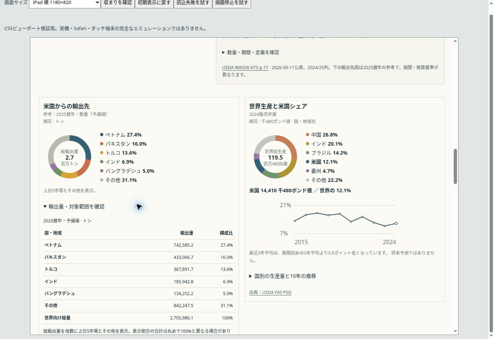

# 農業 v7.1：コンパクトな比較図の実装・確認記録

記録日：2026-09-14。設計は[PR #38](https://github.com/guchio2366-dev/insight-journal/pull/38)。基準mainは`7d4cbac49b66b8fca558cab3ee64e7d022fd8a28`。自然環境・主要産業の既存変更を含む。

## 実装した表示

- 詳説上段に説明と供給元・行き先、下段に全幅の比較行を置いた。CSS幅960px以上では輸出先が左、世界生産が右。狭幅は所定の順序で1列になる。
- 円のすぐ右に色印・国名・％をまとめた。通常の円は144px、スマホは132px。375px・390px幅では一覧を右側に保ち、360px未満は円の下に置く。
- 作物輸出のSVGを共通の144座標・中央3行へ揃えた。国名・％は14px、米国数量と出典の古い10px固定指定を解消した。
- 米国シェアの推移を最大幅360pxに整理し、年と目盛りの文字を確保した。系列・縦軸・座標計算は維持した。
- 作物輸出に既存値の展開表を加えた。酪農だけに追加内訳の領域を出力する。数量／金額、年、単位、予備値、品目範囲、FAO集計差と出典は引き続き表示する。

アプリの変更は設計の6ファイル。既存の検証ページにも959px・960px・320pxの選択肢を加え、切替境界と狭幅を同じUIで確認できるようにした。統計ファイル・集計・URL制御・地図のコード・依存パッケージは変更していない。

## 自動確認

`npm run check`が成功した。単体77件、ビルド後の組み込み試験25件、Astroビルド、公開物の境界検査を含む。既存のURL復元、詳細の独立、乳換算、キーボード操作、地図失敗時、非JavaScript、他分野との状態共有を検証している。検証ページの選択肢追加後の最終CI（34813501000、34813545639）でも成功した。

変更前後のビルド済みHTMLを使った追加照合では、全10パネル・121個の扇形の割合と順序、国名・％、10個の推移の点列、米国数量が一致した。新しい作物輸出表35行の数量が既存データと一致し、追加領域は酪農の1個だけであることも確認した。

| gzipサイズ | 基準main | 実装 | 差分 |
|---|---:|---:|---:|
| 農業HTML | 125,866 B | 126,423 B | +557 B |
| 生成された全JS/CSS | 465,698 B | 465,872 B | +174 B |
| 合計 | 591,564 B | 592,295 B | +731 B |

同一環境のビルドをPython gzipの同じ条件で比較した。全JS/CSSはPagefind等も含む保守的な集計で、農業ページの実ネットワーク転送量そのものではない。外部通信・描画インスタンス・ランタイム依存の追加はない。設計の10KiBの目安を下回る。

## 画面・公開確認

[実装PR #39](https://github.com/guchio2366-dev/insight-journal/pull/39)を統合し、コミット`8d2a2af9218ddeb391d8d4d59867f77749e29c8d`を本番へ公開した。[Pages実行34813682374](https://github.com/guchio2366-dev/insight-journal/actions/runs/34813682374)は成功し、公開先の`_release.json`でも同じコミットを確認した。

公開サイトのChrome・既存CSSビューポート検証ページで47ケースを確認した。1024px・1180px・375pxは全10品目、959px・960px・390px・320pxは米・綿花・酪農・採卵鶏を切り替えた。横はみ出し、一覧の14px文字、円と一覧の位置、960pxでの2列切替、左右の円の高さが検査を通った。1180pxでは綿花の輸出詳細表を開いた状態も確認した。

[確認JSON](qa/agriculture-v7.1-verification.json)と[本番レイアウト実測](qa/agriculture-v7.1-live-verification.json)に結果を保存した。実機iPad・iPhoneおよびSafariは未確認。ブラウザのWebGLが使えないため地図は代替表示で確認した。設計に列挙した残りの画面幅と手動操作の全組合せは今回再確認していない。URL復元・キーボード等は既存自動試験の確認範囲である。
