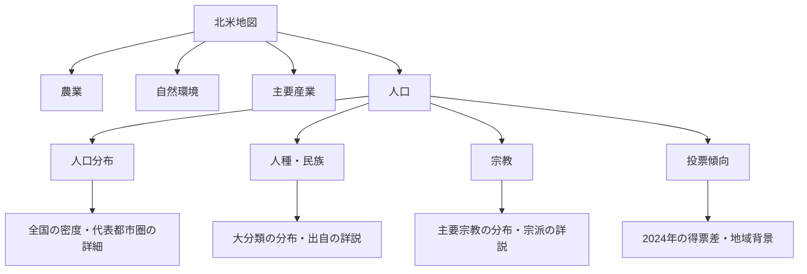

# Insight Journal 北米アトラス「人口」設計書 v1.0

作成日：2026-09-14  
状態：推奨方針は利用者承認済み。実装用の詳細設計。画面・データ処理の実装前。  
対象：`guchio2366-dev/insight-journal`、米国本土の地図。全国統計は原則50州＋D.C.。  
確認したmain：`abe7627fc76e8e6ecb631bf0fd306b09c672c5fe`。取得時点の記録であり、実装開始時は最新mainを再確認する。

## 1. 確定した目的と範囲

人口タブは、どこにどのような人々が暮らし、その地域社会がどう形成されたかを、地図・全国統計・詳説・インサイトで学ぶ入口である。農業・自然環境・主要産業と並ぶ第4のメインタブにする。

利用者は本会話の推奨案をすべて採用し、細部は目的に沿って具体化するよう指示した。本書を作るための追加判断依頼はない。

| 項目 | 確定方針 |
|---|---|
| メインタブ | 農業／自然環境／主要産業／人口 |
| 人口のサブタブ | 人口分布／人種・民族／宗教／投票傾向 |
| 初期表示 | 人口分布・全国図。位置と人口集中を最初の入口にする |
| 人種・民族 | 大分類を地図と全国統計に表示。国・地域別の出自は下部の詳説 |
| 郊外 | 大都市中心部に対する、周辺の住宅地・通勤圏という意味で扱う |
| 人口分布 | 全国の郡別人口密度＋代表都市圏の地区別人口密度 |
| 宗教 | 主要宗教とキリスト教の主要区分を表示。プロテスタントの内部区分は詳説 |
| 投票傾向 | 2024年大統領選の郡別得票差。大まかな地域差を読む |
| 共通レイアウト | 左に大きな地図、右に全国の統計・読み方、下に詳説とインサイト |
| 分野間比較 | 同じ場所・倍率で他のタブへ移り、人口と産業・自然条件を見比べる |

初版には、出自ごとの全国細密地図、すべての都市圏の詳細図、リアルタイムの政党支持率、選挙予測、人口将来推計、年齢構成の専用画面を含めない。これらは今回合意した学習範囲への追加になる。

## 2. 情報構造と読む順序

共通の導線は「サブタブを選ぶ → 地図で分布を見る → 地域を選んで要点を読む → 下部で背景を読む → インサイトから他分野と比較する」。地図の操作だけで背景説明を読み終える構成にはしない。

| 位置 | 内容 | 更新の契機 |
|---|---|---|
| 上部 | 既存メインタブ＋人口の4サブタブ | タブ変更 |
| 地図の近く | 集団・宗教の選択、または全国／代表都市圏の選択 | サブタブ・対象変更 |
| 左約7割 | 地図、単位・対象時期、短い凡例、全体表示・拡大縮小 | 対象・地域変更 |
| 右上 | サブタブに対応する全国統計 | サブタブ変更 |
| 右下 | 補助統計、または全国図の読み方 | サブタブ変更 |
| 地図直下 | 選択地域の短いカード。対象名、数値、要点、詳説リンク | 地域選択 |
| 下部1 | 分野・集団・都市圏の背景説明 | 対象変更 |
| 下部2 | 人口を他分野と見比べるインサイト | 関連項目を上位表示 |
| 末尾 | 数値表、出典、対象期間、集計・分類方法 | データ更新 |

右側は全国の比較基準を担当する。個別地域をタップしても全国統計の分母は変えない。全国構成の棒を新たな選択ボタンにはせず、選択操作は地図付近へ集約する。2枠を埋めるためだけに同じ数字や不要なグラフを追加しない。

## 3. 人口分布

### 3.1 全国図

全国の郡別人口密度を色の濃淡で示す。人口密度は人口推計÷陸地面積（km²）とし、Web Mercator上の描画面積から計算しない。主要都市名と薄い州境を残す。人口ゼロ、水面、欠測は区別する。

人口は2020–2024年ACS 5年推計のB01003を第一候補とする。地理形状・陸地面積は同じ地域コードと整合するCensusの公表資料を使う。5年推計は期間推計であり「2024年末の人口」と記載しない。[S1][S2]

密度の区切りは、0、0超–1未満、1–10未満、10–100未満、100–1,000未満、1,000–10,000未満、10,000以上（人/km²）を初期値とする。凡例には境界値を直接記載する。実データ確認で空の階級が生じても、地域の順位に合わせて尺度を毎回変更しない。

右上は全米の人口と人口密度。右下はNCHS分類を用いた「大都市圏の中心郡／大都市圏の周辺郡／中小都市圏／非都市圏」の人口構成とする。NCHSの6区分を、1、2、3＋4、5＋6に集約し、人口は地図と同じACS期間の郡人口を合算する。分類年と人口の対象期間を別々に表示する。NCHS掲載の丸め済み人口割合を、そのまま別年の人口へ適用しない。[S3]

中心郡・周辺郡の区別は人口100万人以上の都市圏が対象であり、一般的な市中心部・郊外そのものではない。グラフにも「郡の分類」と表示し、厳密な郊外人口比とは呼ばない。

### 3.2 代表都市圏

初版の都市圏は次の3つとする。選定はデータ確認の観点によるものであり、居住や投票の特徴を調べずに断定するための分類ではない。

| 都市圏ID | 表示名 | 比較で確認する観点 |
|---|---|---|
| new-york | ニューヨーク | 中心の高密度地区と、州境をまたぐ周辺地域の広がり |
| los-angeles | ロサンゼルス | 郡内の人口分布と、市の境界・周辺の市街地との関係 |
| dallas-fort-worth | ダラス＝フォートワース | 複数の主要市と、それぞれの周辺地域のつながり |

都市名の選択で、その都市圏の公表地理範囲へ移動し、地区（census tract）別の人口密度へ切り替える。取得するのは選んだ都市圏のファイルだけとする。全国へ戻れば郡別表示に戻る。全国図と詳細図は、同じ密度尺度・単位・ACS期間を使う。

詳細図には主要市域の輪郭、主要市名、2020 Censusの都市的地域（Urban Area）の概略輪郭を重ねる。主要市域はCensus／OMBの都市圏・主要市資料を基準に確定し、名称だけから半径や境界を描かない。形状の年は凡例・出典で確認できるようにする。[S4]

「主要市域の外に広がる都市的地域」を郊外を読む目安とし、人口密度と併せて比較する。都市圏の外縁には低密度地域も含まれるため、主要市の外側すべてを一律に郊外として塗らない。主要市域にも住宅地があり、主要市域と都心・中心業務地区は同義ではない。

初版は、地区の人口を主要市と郊外へ面積比で配賦しない。市境をまたぐ地区を適当に切り分けた「郊外人口」を作らず、地区ごとの公表人口・密度と境界の位置関係を提示する。都市圏内の厳密な中心部／郊外人口構成グラフは初版の必須要件にしない。

選択カードには都市圏名・地区名／コード・人口・密度・対象期間を表示する。数字の直下に、読むべき中心と周辺の位置関係を2〜3文で説明し、下部の都市圏比較へ接続する。

## 4. 人種・民族

### 4.1 大分類と二重計上の防止

2020–2024年ACS 5年推計B03002の大分類を使う。全国・郡の同じ分類、同じ期間、同じ対象人口を保持する。[S1][S5]

| 表示名 | ID | B03002の推計値 | 集計上の意味 |
|---|---|---|---|
| 白人 | white-nh | 003E | 非ヒスパニック、白人単独回答 |
| 黒人・アフリカ系 | black-nh | 004E | 非ヒスパニック、当該人種単独回答 |
| ヒスパニック・ラティーノ系 | hispanic | 012E | 人種を問わないヒスパニック系の全体 |
| アジア系 | asian-nh | 006E | 非ヒスパニック、アジア系単独回答 |
| アメリカ先住民・アラスカ先住民 | aian-nh | 005E | 非ヒスパニック、当該人種単独回答 |
| ハワイ先住民・その他太平洋諸島系 | nhpi-nh | 007E | 非ヒスパニック、当該人種単独回答 |
| 複数人種 | multiracial-nh | 009E | 非ヒスパニック、2つ以上の人種回答 |
| その他 | other-nh | 008E | 非ヒスパニック、その他の人種単独回答 |

表の変数はすべて`B03002_`を接頭辞とする。分母は001E。009Eの内訳である010E・011Eを再加算しない。ヒスパニック系以外が非ヒスパニックに限定されることを、凡例近くに一度短く示す。短い表示名の統計上の完全な意味は数値表に残す。

### 4.2 地図・グラフ

郡別の「選択集団÷その郡の総人口」の割合を濃淡で示す。初期選択は分類表の先頭である白人（非ヒスパニック）。凡例／選択欄から他の7分類へ移る。人数は地域カードに併記する。

割合の尺度は0–100%を共通とし、0、0超–1未満、1–5未満、5–10未満、10–25未満、25–50未満、50–75未満、75–100%を初期区切りとする。同じ濃さが、集団を変えても同じ割合を意味する。最大集団の名前だけで郡を塗り分ける表示は採用しない。

右上は全米8分類の構成を、共通の0起点・0–100%目盛りの横棒と値で示す。右下は全国の総人口・対象期間と、分類の読み方を短く置く。地域選択で右欄をその地域の構成へ変更しない。

ACSの推計値、誤差、未公表・取得失敗・対象外を区別する。元表の推計誤差は数値表に保持し、割合の誤差を出す場合はCensusの比率計算方法に従う。計算していない信頼区間を描かない。

### 4.3 出自の詳説

大分類の説明の下に、メキシコ系・キューバ系、中国系・インド系・日系、ドイツ系・アイルランド系など、地域差を説明するのに必要な出自を扱う。各項目は「どこに暮らすか／どのような移住・定住の経緯があるか／大分類だけでは分からない点」の3点でまとめる。

出自・祖先・出生地・国籍は同義ではない。個別の原表の質問・母集団を表示し、大分類のグラフへ異なる定義の人数を足さない。複数の出自回答が可能な表では、合計100%の内訳として扱わない。

中東・北アフリカ系は詳説の対象とする。2024年の新基準でMENAが独立区分に追加されたことと、本書のB03002に独立区分がないことを区別する。新旧分類を無理に接合して9分類にしない。[S6]

## 5. 宗教

Pew Research Centerの2023–24 Religious Landscape Studyを基準に、州別の成人の宗教的所属を示す。全国・州・公表都市圏を利用し、公表されていない郡や地区へ割合を補間しない。[S7]

入口の分類は、プロテスタント、カトリック、末日聖徒、その他のキリスト教、ユダヤ教、イスラム教、仏教、ヒンドゥー教、その他の宗教、無宗教とする。公表分類との対応表をデータ生成時に作る。プロテスタントの福音派・主流派・歴史的黒人教会系は下部の詳説で扱う。

初期選択はプロテスタント。選んだ宗教の州内成人に占める割合を、共通の0–100%尺度と人種・民族に準じた区切りで描く。州名と境界を残し、州全域の住民が一様にその宗教であるような名称は付けない。地図は「成人の所属割合」と明記する。

右上は全米の宗教構成の横棒。右下は全国の大分類の読み方を短く説明する。元資料が丸め済み割合だけの場合、その数値を保持し、合計を100に合わせる再配分はしない。正教会などを「その他のキリスト教」にまとめる際も、原分類を追跡できる対応表を残す。

元資料の不足・非表示・小標本による抑制は欠測として扱い、ゼロや全国平均へ置換しない。「1%未満」を0%とすることも禁止する。割合の範囲が示される場合、範囲を保持し、点推計と区別する。

無宗教は宗教的所属の区分であり、「信仰・精神性が一切ない」と説明しない。宗教的所属から民族や個人の政党支持を推定しない。公表都市圏の情報は下部に置き、州全体の統計との母集団を区別する。

## 6. 投票傾向

2024年大統領選の郡別結果を使う。全国で共通する選挙を比較し、2024年の候補者への投票結果として示す。現在の支持率、2026年の情勢評価、恒久的な支持基盤という表示にはしない。[S8]

候補者名はカマラ・ハリス（民主党）、ドナルド・トランプ（共和党）。地図の値は、郡の全有効投票を分母とする「共和党候補の得票率−民主党候補の得票率」、単位はポイントとする。両党票だけを分母に再計算しない。その他候補も総投票数へ含める。

| 得票差 m | 表示 | 色の役割 |
|---|---|---|
| m ≤ −15 | 民主党候補が15ポイント以上上回る | 濃い青 |
| −15 < m ≤ −5 | 民主党候補が5〜15ポイント未満上回る | 薄い青 |
| −5 < m < 5 | 両候補の差が5ポイント未満 | 中立色 |
| 5 ≤ m < 15 | 共和党候補が5〜15ポイント未満上回る | 薄い赤 |
| 15 ≤ m | 共和党候補が15ポイント以上上回る | 濃い赤 |

区切りは読みやすさのための本サイトの表示規則である。選挙予測機関の「接戦」「安全圏」の評価ではない。

地域カードは郡名、両候補の得票率、その他候補の合計、全有効投票数、得票差を示す。右上は全米の得票構成（民主党候補／共和党候補／その他）。右下では得票差の読み方と、地図の面積が票数を表さないことを短く説明する。

原資料はMIT Election Labの郡別データを第一候補とし、公的な全国・州の確定結果で集計を照合する。同一候補の複数政党行、投票方式別行、合計行の重複を点検する。郡コードが欠ける行や行政区分変更を無理な地名一致や面積比例で変換しない。

他のサブタブと地理コードの年が一致しない場合は、公式の対応関係を確認する。特にコネティカットの旧郡とplanning regionなどは、票を正確に合算できなければ投票地図用の対応する境界を用意する。全国の得票構成は、本土に表示できた郡だけの合計にしない。

## 7. 詳説とインサイトの編集

各詳説の先頭には、その画面で分かることを3〜5文で置く。その下を「分布の特徴／歴史・形成要因／他分野との関係」の順にする。地図を見た直後に、用語だけでなく地域の位置関係を説明できる内容を目指す。

初版のインサイトは次の3本を作る。現時点では編集テーマであり、主張を裏づける資料の取得・執筆を実装工程に含める。

| テーマ | 比較対象・導線 | 根拠の扱い |
|---|---|---|
| 人口の集中とサービス業の集積 | 人口分布 ↔ 主要産業のサービス業 | 産業集積・雇用と居住人口の違いを説明する |
| 中心部と周辺地域の投票傾向 | 代表都市圏の人口分布 ↔ 同じ範囲の郡別投票結果 | 人口は地区、投票は郡という粒度の差を明示する |
| 移住・定住の歴史と宗教・民族の分布 | 人種・民族 ↔ 宗教 | 集団・宗派ごとに個別資料を付け、相関を因果と断定しない |

各インサイトは「比較する地域」「地図で確認できる事実」「背景を支える資料」「ここからは断定できないこと」「比較先へのリンク」を持つ。「見比べてみよう」という問いだけでは完成扱いにしない。

地図上の説明カードは長文で埋めず、要点と詳説リンクに絞る。出典は主張の近くと末尾の資料表へ置き、本文の各文に長い注意書きを付けない。

## 8. 状態・操作・画面サイズ

メイン経路は`/atlas/north-america/population/`。共有URLには下記を保持する。既存の自然環境の`city`、農業の`region`などと名前を衝突させない。

| パラメーター | 内容 |
|---|---|
| popView | density／ethnicity／religion／vote。既定density |
| popEthnicity | 第4節の8分類ID。既定white-nh |
| popReligion | 公表分類に対応した宗教ID。既定protestant |
| popMetro | 全国または第3節の3都市圏ID |
| popGeo | 地域種別と地域コード。選択中の図に含まれるものだけを許可 |
| popInsight | 初版インサイトのID |
| lng・lat・z・view | 既存共通の地図カメラと全体表示状態 |

無効なID・他の図の地域コードは解除し、既定画面へ戻す。サブタブの変更ではその図に属さない地域カードを閉じる。集団・宗教の前回選択は各モード別に保持する。戻る／進むと直接URLで同じ状態を復元する。

現在の共通コードは表示・URL復元とも最大倍率7である。都市内部を読めるよう、人口追加時に共通の最大倍率を10へそろえる。URLだけ、または描画側だけを変更しない。他分野へ移っても同じ位置と倍率を保持し、既存の自然環境で細密等高線の再読込を復活させない。拡大は既存データの精細度向上を意味しない。

サブタブ変更や地域タップによる自動スクロールは行わない。都市圏の選択、「詳説へ」「地図で位置を見る」「全国へ」の明示操作でだけ移動する。1本指はページスクロール、地図操作は既存の2本指操作と＋／−／全体ボタンを継承する。

| 表示環境 | 仕様 |
|---|---|
| iPad横・PC | 地図を左約7割、全国情報を右。詳説・インサイトは下 |
| iPad縦・分割画面 | 幅に応じて全国情報を地図の下へ。地図を過度に縮小しない |
| iPhone縦 | 短いタブ・対象選択→地図→地域カード→全国情報→詳説 |
| iPhone横 | 高さを優先して見出し・操作部を圧縮。地図とタブを初期画面へ収める |

主要なタップ領域は44 CSS pxを目安とする。操作列を増やしすぎず、長い分類名は短い表示＋正式名の説明で対応する。ホバーだけで数値を読ませない。地域一覧・集団選択・数値表からも同じ内容へ到達できるようにする。

## 9. 描画・データ・費用

地図は既存MapLibreの1インスタンスを共有し、薄い地形・河川・州境を背景にする。主題の色を阻害する地形陰影は人口表示で弱める。視点は既存の北向き・2Dを保持する。新しい地図サービスや有料APIは追加しない。

主題は実測・推計の地域データによるコロプレス図。郡・州・地区の境界には出典付きの形状を使い、説明文に合わせて境界を創作しない。地図は立地・隣接関係を、横棒・数値表は人数と割合の比較を担当する。

| 視覚要素 | 役割 | 設計・確認 |
|---|---|---|
| 全国・都市圏の地図 | 分布、密度、隣接関係 | 地図の専門スキルに基づくローカル確認。母数・投影・境界・欠測を点検 |
| 全国構成の横棒 | 同じ全国母集団で比較 | 統計の専門スキルに基づくローカル確認。0起点・単位・丸め・誤差を点検 |
| 選択カード・詳説 | 図から背景理解へ移る | 対象名・期間・数値・根拠・リンク先の一致を点検 |
| 静的な代替図・表 | 地図描画に失敗しても学べる | 本表示と同じ分類・期間・色の意味を保持 |

色の役割は、人口密度＝暖色の単色濃淡、人種・民族＝青緑の単色濃淡、宗教＝紫の単色濃淡、投票＝青・中立・赤、選択枠＝濃い中立色、欠測＝灰色と模様で区別する。色だけに依存せず、凡例・数値・地域名を併記する。画面サイズを変えても尺度を変えない。

統計と形状は事前加工して静的配信する。閲覧時にCensus・Pew・MITへ直接APIを呼ばない。取得元URL、対象期間、取得日、版、ファイルハッシュ、単位、地理ID、加工方法、利用条件・必要な帰属表記をデータ台帳に残す。

人口タブを開く前に新しい人口地理データを取得しない。全国の郡境界は人口密度・民族・投票で整合する範囲を共用し、数値列は軽い別ファイルにする。宗教の州データ、都市圏の地区データは選択時に取得する。3都市圏の一括先読みはしない。都市圏詳細は現在＋直前の最大2件を保持する。

性能の初期予算は、人口用の追加制御コードと初期数値で圧縮後150KB、全国郡境界で圧縮後1MB、都市圏の詳細形状で1都市圏あたり圧縮後1MBを目標とする。いずれも実測値ではない。超過時は不要属性の除去、共有境界の簡略化、地域別分割の順に調整し、学習内容を無断で削らない。

大量の生データは通常ビルドの入力取得から分離する。通常のビルドは取得済みの検証済みスナップショットを使う。更新作業だけが原資料の取得・加工を行う。利用条件の不適合があれば適合する公表集計・帰属方式を先に探し、有料化や大幅な機能変更が避けられない場合だけ利用者へ具体案を示す。

## 10. 欠測・読込失敗・代替表示

地域データは`observed`（公表集計）、`estimated`（推計）、`suppressed`（公表抑制）、`missing`（未取得・未公表）、`not-applicable`（対象外）を区別する。表示に必要な母数がない場合は割合を計算しない。

読込中も地図の枠と全国情報を残す。失敗時はその図の静的な代替図、地域名・数値表、詳説と再試行を表示する。WebGLやJavaScriptが使えなくても初期の全国人口図と4分野の説明へ到達できるようにする。

通信失敗のPromiseを永久に保持しない。画面切替後に届いた古い応答で現画面を上書きしない。明示再試行以外の無制限な再取得をしない。データの時点・取得状態を、0人や0%に置き換えない。

## 11. 既存コードとの接続

取得したmainに人口の実装と`AGENTS.md`は見当たらない。実装開始時に最新main・関連PR・作業指示を改めて確認し、他タブの更新を引き継ぐ。本書の作成ではリポジトリのファイル・公開画面を変更していない。

| 既存ファイル／新設案 | 担当する変更 |
|---|---|
| `src/data/atlas/regions.ts` | 人口のメインタブを追加 |
| `src/data/atlas/explorer.ts` | 分野型へpopulationを追加 |
| `src/components/atlas/AtlasExplorer.astro` | 人口のナビゲーション・全国情報・詳説の差込 |
| `src/lib/atlas-state.ts` | populationの状態接続、カメラ倍率の整合 |
| `src/scripts/atlas-explorer.ts` | 共通地図への人口制御の接続。既存の動作を維持 |
| `src/styles/atlas-explorer.css` | 既存レイアウトを利用する最小限の調整 |
| `src/pages/atlas/north-america/population/index.astro` | 人口の入口 |
| `src/lib/atlas-population-state.ts`（新設案） | 人口固有の状態・正規化 |
| `src/scripts/atlas-population.ts`（新設案） | 主題切替・数値・地域選択・遅延取得 |
| 人口専用コンポーネント・データ・CSS（新設案） | 分類、全国情報、地域カード、詳説、インサイト |

共有ファイルの差分を小さくし、人口固有の処理を別モジュールへ置く。農業・自然環境・産業のデータを再生成したり、古い作業コピーで一括置換したりしない。

## 12. 実装順と完成条件

| 順序 | 作業 | 完了を判断する成果物 |
|---|---|---|
| 1 | 原資料・利用条件・地理IDの照合 | 4分野のデータ台帳、分類対応表、実データの小標本と集計検算 |
| 2 | 共通枠＋全国人口密度 | 第4タブ、4サブタブ、全国図、右欄、地域カード、代替図 |
| 3 | 人種・民族と宗教 | 分類選択、正しい母数・欠測、全国構成、出自・宗派の詳説 |
| 4 | 投票傾向 | 2024年の郡別地図と全国集計、地理・候補者・集計の照合 |
| 5 | 3都市圏の詳細とインサイト | 地区別密度、主要市・都市的地域の輪郭、比較導線、根拠付き原稿 |
| 6 | 統合確認 | 小画面・失敗時・戻る操作・他分野往復・負荷の確認記録 |

データの一部が未確認の段階を、4サブタブの完成として扱わない。全分類・全国値・3都市圏・詳説・インサイトまでを初版の完成範囲とする。

意味のある検証は次を中心に行う。

- 民族8分類の合計と総人口、ヒスパニック系の重複排除、割合の範囲、期間・単位・地域コードの一致。
- 宗教の公表抑制・範囲値・丸めの保持。成人割合を総人口割合へ読み替えていないこと。
- 投票の候補者・方式・集計行の重複除去、全有効票との照合、全国値が本土表示範囲に限定されないこと。
- 郡→地区への実データ切替。単なる拡大で地区別表示と称していないこと。境界の簡略化で市名や密度の対応が崩れないこと。
- 4サブタブ、地域選択、閉じる、全国へ、URL直接表示、戻る／進む、他メインタブとの往復。
- 390×844、844×390、820×1180、1180×820、iPad分割幅507、PC幅1440で、地図・タブ・主要操作の配置と横はみ出し。
- ネットワーク失敗、WebGLなし、古い応答の遅着、キャッシュ上限、再試行、キーボード・タップ・縮小動作。
- 人口未選択時の追加取得ゼロ、1都市圏だけの取得、圧縮後容量、隠れたレイヤー・地図インスタンスの重複なし。

画面幅を再現したブラウザ確認と、実機Safari・GPU・タッチ操作の確認は分けて記録する。実機未確認を検証済みと記載しない。

### 設計レビューの結果

2026-09-14時点の設計確認で、(1)「支持政党」は2024年の投票結果へ具体化、(2)民族大分類と出自を分離、(3)郡単位で見えない都市内差を3都市圏の地区データで補完、(4)宗教の成人・州単位を保持、(5)既存最大倍率7と都市詳細の整合、を本書へ反映した。追加の利用者判断事項はない。

実データ全件の取得、ライセンス適合性の最終確認、地域コードの全件照合、加工後の容量測定、画面・動作試験は実装工程で行う技術確認である。これらを実施済みとみなさない。目的・費用・初版範囲を変える必要が生じた場合に限り、具体的な代替案と影響を示して相談する。

## 13. 資料

以下は設計の根拠・実装時の取得入口であり、原データの全件ダウンロード済み一覧ではない。

- [S1：ACS 1年・5年推計の使い分け](https://www.census.gov/programs-surveys/acs/guidance/estimates.html)。5年推計の期間・小地域利用。
- [S2：2020–2024 ACS B01003 総人口](https://api.census.gov/data/2024/acs/acs5/groups/B01003.html)。取得時に系列・範囲を照合する。
- [S3：NCHS Urban-Rural Classification](https://www.cdc.gov/nchs/data-analysis-tools/urban-rural.html)。2023分類、中心郡・周辺郡の意味と適用範囲。
- [S4：Census Urban and Rural](https://www.census.gov/programs-surveys/geography/guidance/geo-areas/urban-rural.html)。都市的地域の定義、2020年境界の取得入口。
- [S5：2020–2024 ACS B03002 人種・ヒスパニック系](https://api.census.gov/data/2024/acs/acs5/groups/B03002.html)。相互排他的な8分類の変数。
- [S6：人種・民族の統計基準の改訂](https://www.census.gov/newsroom/blogs/random-samplings/2024/04/updates-race-ethnicity-standards.html)。MENA区分と新旧分類の違い。
- [S7：Pew Religious Landscape Study](https://www.pewresearch.org/religious-landscape-study/)。2023–24年の成人の宗教的所属、分類、州・都市圏。
- [S8：MIT Election Lab データ一覧](https://electionlab.mit.edu/data)。County Presidential Election Returns 2000–2024。
- [既存の主要産業設計](https://github.com/guchio2366-dev/insight-journal/blob/abe7627fc76e8e6ecb631bf0fd306b09c672c5fe/docs/atlas-major-industries-design-v1.0.md)。共通レイアウト、全国統計と個別選択の役割。
- [既存の地図コンポーネント](https://github.com/guchio2366-dev/insight-journal/blob/abe7627fc76e8e6ecb631bf0fd306b09c672c5fe/src/components/atlas/AtlasExplorer.astro)。共通の地図・説明・全国情報の枠。
- [既存のURL状態](https://github.com/guchio2366-dev/insight-journal/blob/abe7627fc76e8e6ecb631bf0fd306b09c672c5fe/src/lib/atlas-state.ts)。地図カメラ、各分野の状態、現在の倍率上限。