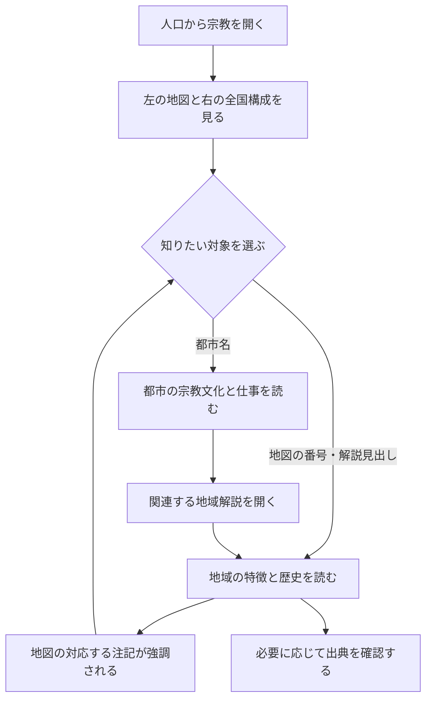

# 人口タブ「宗教」設計書 v1.2

作成：2026-09-14。対象：Insight Journal の北米・人口ページ。

本書は「全国の宗教構成＋地域に根付いた宗教文化」を先に完成させるための設計である。画面実装・データ更新・公開は今回行わない。宗教以外の人口タブの仕様は [都市解説への改修記録](atlas-population-city-reading-v1.1.md) を引き継ぐ。

確認した実装の基準は main の `6c8f1c53419940cee07a1b6c4c495e34be594356`。自然環境側の都市ラベル改修を含む。後続実装では、その時点の main を取り込み、共用の都市カタログ・ラベル配置を使う。

## 1. 今回の到達点と採用理由

読者が、全国の構成を把握し、地図上の地域や都市を選んで「どんな宗教文化があるか」「どのような歴史を背景にしているか」を説明できる状態を目指す。

| 決定 | 仕様 | この判断を採る理由 |
| --- | --- | --- |
| 全国構成 | Pew 2023–24年調査の公表済み5分類を円グラフで表示 | 全国の大枠を短時間で読め、既存の独自10分類への再集計を避けられる |
| 地域の見せ方 | 主要都市と6項目の地理解説を同じ地図に置く | 定住・移住の歴史と場所を結び付ける目的に直接役立つ |
| 都市の操作 | 気候タブと共通の12都市を選択 | 既に覚えた都市の位置と操作を利用できる |
| データ源 | 全国構成と現状の地域傾向はPew、歴史は公的機関・研究機関の資料 | 現在の割合と、その背景を説明する歴史の根拠を分けて扱える |
| 実装の分割 | 説明地図を第1段階、州別の数値地図を第2段階とする | 全州・全分類の収集を第1段階の完成条件にせず、画面を小さく検証できる |

今回採用する分析は「全国の構成」と「地域的特徴の説明」。図表はSVGの小さな円グラフ、地図は既存MapLibre上の注記、代替表示は同じ内容の静的地図とHTMLの一覧とする。新しい地図エンジンは加えない。

### 現状から変わる部分

現在は州別原表が0件で、全国は確認済み8分類・合計94.9%を表示している。第1段階では、灰色の州を未取得として並べる画面から、地域解説を読む画面に切り替える。

Pewには州・地域・都市圏の公開集計がある。一方、予定する全州・全分類の一括取得・再掲載方法は未整理である。「州別データが存在しない」「転載が一律禁止」「必ず有料」という意味ではない。[Pewの公開集計](https://www.pewresearch.org/religious-landscape-study/)・[利用条件](https://www.pewresearch.org/about/terms-and-conditions/)

## 2. 読者の導線

都市・解説を選択しても、全国の円グラフの値と地図の表示範囲は変えない。地図上に大きな吹き出しを重ねず、説明は右側に集約する。

### 操作と状態

| 操作・状態 | 地図 | 右側・画面移動 |
| --- | --- | --- |
| 初めて開く | 12都市と6項目の番号を表示。自動選択なし | 総論、全国構成、地域解説6見出し。空の都市説明枠は置かない |
| 都市名を選ぶ | 選択都市を強調。カメラは保持 | 都市説明を表示。全国構成は固定 |
| 地図の番号を選ぶ | 対応番号を強調。宗教の面分布は描かない | 対応する地域解説を開く |
| 地域解説の見出しを開く | 同じ番号を強調 | 原則1項目を展開。都市説明があれば保持 |
| 都市説明内の関連解説を選ぶ | 対応番号を強調 | 該当する地域解説を開く |
| 戻る・進む、URLを開き直す | 都市・解説の選択を復元 | 対応内容を復元。履歴復元では自動スクロールしない |
| 他の人口タブへ移る | 宗教専用の番号と強調を解放 | 都市選択は共通のまま維持 |

既存の `popCity` を維持し、開いている地域解説は `popReligionStory` で保存する。値は後述の6個のIDか未選択。無効な値は未選択に戻す。明示操作は履歴へ追加し、表示更新だけで履歴を増やさない。

旧URLの `popReligion` は第1段階の画面では操作対象にしないが、入力があっても正常に開く。旧 `popGeo=state:…` から未取得の数値枠を復活させない。他タブの `popGeo` やフィルターは壊さない。地域解説の選択と都市選択は別の状態として扱う。

## 3. レイアウトと表示の優先順位

### iPad横・PC

既存の2列を継続し、左に地図、右に本文を置く。基準は幅900px以上かつ高さ600px以上。地図と右側の総論を上端でそろえる。

| 位置 | 表示内容 | 分量・大きさの目安 |
| --- | --- | --- |
| 左 | 既存の米国地図、薄い州境・州名、12都市、①〜⑥の注記 | 全体表示を優先。地図上の長文なし |
| 地図直下 | 番号と地域名の対応、「番号は解説する場所を示す」の短い説明 | 1〜2行。都市一覧は既存の折り畳みを使用 |
| 右上 | 総論 | 見出し1つ、本文80〜120字程度 |
| 総論の下 | 全国の円グラフ＋分類名・割合 | 直径104〜120px。凡例は5分類＋差分1行 |
| 円グラフの下 | 選択都市の説明 | 選択時のみ。宗教文化2文程度、産業・仕事の既存説明 |
| 続き | 「地域に根付いた宗教文化」6項目 | 見出しと地域名は常時。展開本文120〜180字程度 |
| 末尾 | 「出典・分類について」 | 調査年・分母以外の詳しい注記はここに集約 |

左の地図は既存の追従表示を使う。本文を地図の高さに無理に押し込まず、展開した場合はページ全体を縦に伸ばす。右側に別の小さなスクロール枠は作らない。

### iPhone縦・iPad縦の狭い表示

順序は「地図 → 番号の対応 → 総論・円グラフ → 選択都市 → 地域解説」。地図上の長い地域名は①〜⑥に短縮する。都市名は共用の衝突回避に従う。

都市名や番号を明示的に選んだときだけ、対応する説明見出しにフォーカスし、説明へ移動する。「地図へ戻る」リンクを同じ説明枠に置く。選択した都市名・番号を読み上げ、動きを抑える端末設定では滑らかなスクロールを使わない。

文字を縮めて収めることはしない。折り返しと余白で調整し、320px幅でも横スクロールを発生させない。主要なタップ領域は44pxを目標にし、番号が重なる場合は引出線・位置調整とHTMLの一覧を利用する。

## 4. 全国の円グラフ

対象は米国成人、調査は2023–24年。全人口・子ども込みの構成ではない。全国にはアラスカ・ハワイも含め、地図の表示範囲と全国値の範囲を混同しない。

| 新しいID | 表示分類 | 公表値 | 含む範囲 |
| --- | --- | ---: | --- |
| `protestant` | プロテスタント | 40% | 福音派、主流派、歴史的黒人プロテスタントなど |
| `catholic` | カトリック | 19% | PewのCatholic分類 |
| `other_christian_broad` | その他のキリスト教 | 3% | 末日聖徒、正教会などを含む公表済みの大分類 |
| `non_christian_broad` | キリスト教以外 | 7% | ユダヤ教、イスラム教、仏教、ヒンドゥー教など |
| `unaffiliated` | 特定の宗教に属さない | 29% | 無神論、不可知論、特にないという回答 |

数値は[PewのExecutive summary](https://www.pewresearch.org/religion/2025/02/26/religious-landscape-study-executive-summary/)に公表された親分類を直接使う。丸められた子分類を足して親分類を作らない。

5分類の合計は98%。残る2ポイントは灰色で残し、「無回答・丸め等の差分」と表示する。これは計算上の差分であり、無回答率が2%という意味ではない。98%を100%に引き伸ばさない。差分を宗教の1分類に割り当てない。

現行10分類の `otherChristian` はLDSと別に置かれている。新しい3%はそれより広い集計なので、既存キーへ代入しない。新しい全国構成のデータと型を分け、旧原表は第2段階用に保持する。

色だけに意味を任せず、分類名と割合を常時表示する。地図の注記番号には宗教ごとの塗り分け色を流用しない。円グラフの色は構成、地図の強調色は選択という役割に分ける。

総論の原稿案：

> 米国の宗教構成は、プロテスタントとカトリックが大きな割合を占め、特定の宗教に属さない人も約3割いる。地図の番号をたどると、移住や定住の歴史が地域の宗教文化とどう重なるかを見比べられる。

「特定の宗教に属さない」を「信仰も精神性もない」と言い換えない。宗教分類から性格・能力・政治的立場を推定しない。

## 5. 地図と対になる6項目の解説

番号は解説の参照地点であり、信徒の人数、宗教圏の境界、独占的な分布を表さない。第1段階では宗教圏の塗り面や濃淡を追加しない。

| 番号・ID | 見出しと地図で見る場所 | 解説の要点 | 根拠 |
| --- | --- | --- | --- |
| ① `south-protestant` | 南部のプロテスタント／米国南部 | 福音派・バプテスト系などの存在と、プロテスタント内部の違い。「南部は一つの宗派」と読ませない | [Pew：南部](https://www.pewresearch.org/religious-landscape-study/region/south/) |
| ② `utah-lds` | ユタの末日聖徒／ユタ州、ソルトレーク周辺 | 19世紀の西方への移住と共同体の形成。現在の分布と歴史を分けて記述する | [Pew：ユタ](https://www.pewresearch.org/religious-landscape-study/state/utah/)・[NPS：移住の歴史](https://www.nps.gov/mopi/learn/historyculture/index.htm) |
| ③ `northeast-immigration` | 移民が形づくった宗教社会／北東部、ニューヨーク周辺 | アイルランド・イタリアなどからのカトリック移民と、欧州からのユダヤ系移民。宗教・出身地を一対一に対応させない | [The Pluralism Project：Catholic and Jewish Immigrants](https://pluralism.org/catholic-and-jewish-immigrants) |
| ④ `southwest-catholic` | 南西部のカトリックと植民の歴史／カリフォルニアから南西部 | スペインの宣教・植民、先住民の暮らしへの介入、国境の変化と後の移住。文化遺産だけでなく支配・抵抗も扱う | [NPS：南西部の宣教施設](https://www.nps.gov/subjects/travelspanishmissions/introduction.htm)・[NPS：宣教施設での生活](https://www.nps.gov/articles/life-in-the-missions-between-reality-romance-and-revolt.htm) |
| ⑤ `northwest-unaffiliated` | 宗教への所属と信仰は別／太平洋岸北西部、ワシントン州 | 「特定の宗教に属さない」の意味を読む。州の傾向をシアトル市民全員の特徴に置き換えない | [Pew：ワシントン州](https://www.pewresearch.org/religious-landscape-study/state/washington/)・[宗教所属の分類](https://www.pewresearch.org/religion/2025/02/26/religious-landscape-study-religious-identity/) |
| ⑥ `black-churches` | 黒人教会と地域社会／南部と五大湖周辺 | 教会の共同体としての役割、差別・公民権運動の歴史、南部から北部への移住。すべての黒人が同じ宗派という説明はしない | [Pew：黒人の宗教生活](https://www.pewresearch.org/religion/2021/02/16/faith-among-black-americans/)・[米国国立公文書館：大移動](https://www.archives.gov/research/african-americans/migrations/great-migration) |

各解説は「場所 → 特徴 → 歴史 → 地図で見比べる点」の順に書く。上表は掲載テーマと根拠資料であり、全都市の完成原稿ではない。原稿化では、現在の比較や歴史上の因果をそれぞれ直接支える段落を確認する。

参照地点は現実の場所へ固定し、文言を置く位置のみラベル配置で調整する。②のソルトレーク周辺などは注記の参照地点として扱い、気候タブと共通の都市選択に新しい都市を足さない。⑥は南部と五大湖の2地点に同じ番号を置けるが、計測していない移動経路の線は描かない。

①と⑥のように、同じ場所から複数の解説へ進める構成を許す。「6つの宗教圏に米国を分割する」表示にはしない。出典のないランキング、地域全体の性格づけ、移民出身地からの信仰の断定は本文に入れない。

### 12都市の説明に持たせる役割

都市説明の順序は「都市名 → 宗教文化の短い説明 → 主な産業・働く人の特徴 → 関連する地域解説」。産業・職種は既存の共通データを使い、宗教別の仕事という見せ方にはしない。

下表は都市原稿の編集指示である。各都市の具体的な歴史・比較は、Pewの対応する都市圏資料または地域の公的・研究機関資料で確認して原稿にする。最初の版に都市別の割合は追加しない。

| 都市ID | 原稿で取り上げる観点・確認事項 | 地域解説との関係 |
| --- | --- | --- |
| `seattle` | 宗教への所属と信仰・精神性の区別。州と都市の範囲を明示 | ⑤ |
| `san-francisco` | 都市の宗教的多様性。仏教なども「キリスト教以外」の中にあること | ④を歴史の比較対象にする。⑤の対象地域には含めない |
| `los-angeles` | 南西部の歴史と移住。ヒスパニック全体をカトリックと扱わない | ④ |
| `las-vegas` | 都市の成立・人口流入と宗教共同体。ユタの割合を流用しない | ②は隣接する地域との比較のみ |
| `denver` | 山地・平原の接点にある都市の宗教的多様性 | 根拠のある関連がなければリンクを無理に付けない |
| `dallas` | 南部のプロテスタントの中の違いと、都市圏内の多様性 | ① |
| `chicago` | 移民・大移動と宗教共同体の形成 | ⑥、必要に応じ③との比較 |
| `detroit` | 黒人教会と都市圏内の多様性。イスラム教を扱う際はディアボーンと市域を区別 | ⑥ |
| `new-orleans` | フランス・スペイン統治期などの歴史を確認し、南部を一様に扱わない例とする | ①との比較。追加の地域史資料が必要 |
| `miami` | 中南米・カリブからの移住と宗教的多様性 | 南部というだけで①へ自動分類しない |
| `washington-dc` | 黒人教会と地域社会、首都圏の多様性 | ⑥。ワシントン州の⑤と混同しない |
| `new-york` | カトリック・ユダヤ系移民の歴史と現在の多様性 | ③ |

未確認の都市原稿は編集用データで `draft` とし、本番用には採用しない。全12都市に出典付きの短文がそろうことを第1段階の完成条件にする。詳細な宗派別都市統計や長文の都市史は追加しない。

## 6. 出典とデータの扱い

### 取得・利用

第1段階は、全国の5分類と、少数の公表済み地域情報・独自の要約解説を使う。Pewの全表、公式地図画像、本文全体を複製する方式や、自動巡回による一括収集は採用しない。

Pewの条件は、適切な表示を伴う引用・加工等を認める一方、主要部分の転載・無許可の自動収集などに制約を設けている。本書だけであらゆる利用範囲の許諾が確認できたとは扱わない。原稿と引用箇所を具体化したうえで、その範囲への条件の適用を確認する。[Pewの利用条件](https://www.pewresearch.org/about/terms-and-conditions/)

「出典・分類について」には、機関名、資料名、調査期間、公開日、直接リンク、必要な著作権表示をまとめる。Pewを支持者・監修者として扱わない。翻訳を含む箇所については条件に従い、次の表示を出典欄へ置く。

> Pew Research Center has published the original content in English but has not reviewed or approved this translation.

U.S. Religion Censusは今回の割合の代替にしない。同資料のadherentsには会員・子ども・その他の参加者が含まれ、本人申告の成人の宗教所属と一致しないためである。未把握の住民を「特定の宗教に属さない」に変換しない。[U.S. Religion Censusの定義](https://www.usreligioncensus.org/)

### 実装用データの契約

| データ | 必須の内容 |
| --- | --- |
| 全国構成 | `schemaVersion`、`classificationId: pew-rls-2023-24-overview-5`、成人・全国・期間、5つの分類ID、値、公表時の精度、出典ID |
| 地域解説 | `id`、番号、見出し、対象地域、参照地点、本文、関連都市ID、出典ID、確認状況 |
| 都市の宗教解説 | 共通の都市ID、本文、対象範囲（市・都市圏・比較する地域）、関連解説ID、出典ID、確認状況 |
| 出典 | URL、機関、資料名、公開日または不明、確認日、引用・要約した箇所、利用条件の参照先 |

新しい全国構成は、既存の `data/atlas/population-religion-reviewed.json` とは別の原表として置く。旧原表・取得済みデータを消したり、`rows: []` に推測値を入れたりしない。分類の違うデータを同じキーで静かに上書きしない。

欠測や範囲値を0や中央値に置換しない。公開日が不明な資料に日付を創作しない。原稿に数値を追加する場合は、元の年・分母・地域単位をその数値と一緒に保持する。

## 7. 既存実装への接続と軽さ

以下は後続実装で変更する候補であり、本書の作成時点では変更しない。

| 対象 | 変更する役割 |
| --- | --- |
| `src/components/atlas/AtlasExplorer.astro` | 宗教専用の地域解説・出典欄。不要になる宗教選択欄と未取得案内の表示整理 |
| `src/data/atlas/population-reading.ts` | 宗教の総論を差し替え。産業・職種など既存の都市共通データは参照を継続 |
| 新規 `src/data/atlas/population-religion-reading.ts` | 6項目の解説、都市原稿、番号と参照地点、出典の定義 |
| 新規 `data/atlas/population-religion-overview-reviewed.json` | 5分類の全国構成と出典。旧10分類とは別に管理 |
| `scripts/population/prepare-religion.mjs` | 新原表を検証し、全国構成用の小さな配信データを生成。旧原表の生成処理は維持 |
| `src/scripts/atlas-population.ts` | 宗教の説明地図、番号と解説の同期、都市原稿の表示、旧状態との互換性 |
| `src/lib/atlas-population-state.ts` | `popReligionStory` の検証・保存・復元 |
| `src/lib/atlas-population-loader.ts` | 宗教の第1段階で必要な小さなデータだけを読む経路 |
| `src/lib/atlas-population-chart.ts` | 既存SVGを利用。差分ラベルを宗教用に指定できるよう必要最小限の拡張 |
| `src/styles/atlas-population.css` | 番号・解説の強調と狭幅の調整。宗教専用スタイルを限定 |

共用の都市カタログ、MapLibreのインスタンス、州境、ラベル配置は再利用する。宗教のための第2の地図、追加のグラフライブラリー、表示のたびに呼ぶ外部統計APIは作らない。

番号は小さなHTML/SVGの注記として追加し、地図の投影・サイズ変更に追従させる。緯度経度や表示位置の計算をWebGL版と代替図で共有する。宗教専用の注記はタブを離れたら破棄し、共用地図や他タブのレイヤーは削除しない。

宗教の第1段階では、郡別の人口・民族・投票データや都市圏のトラクト境界を新たに要求しない。共通地図が既に必要とする背景データの利用は継続する。

容量の設計目標は、追加の宗教本文・全国構成・参照地点を合わせてgzip 20KB以内、追加JavaScriptをgzip 5KB以内とする。これは実測結果ではない。静的代替図は既存資産の再利用を優先し、新たな写真・高解像度ラスターは加えない。

WebGLや地図通信に失敗しても、同じ番号の代替図、都市一覧、全国値、解説を読めること。宗教データの読込失敗は既存のタイムアウト・再試行方式で扱い、読めている本文まで空にしない。

## 8. 小さく区切る実装順序と完了条件

| 区切り | 作業 | その時点で確認・保存する成果 |
| --- | --- | --- |
| A：内容 | 全国5分類、6解説、12都市の短文と出典を確定 | 原表・原稿・出典一覧。地域と数値の単位が一致するか確認 |
| B：右側 | 総論・円グラフ・都市原稿・地域解説を配置 | 地図を操作しなくても本文を確認できる画面 |
| C：地図 | 番号、都市選択、解説との同期、代替図を接続 | 左右を見比べられる操作。URL復元と狭幅表示 |
| D：仕上げ | 変更範囲のテスト・表示確認、文言調整 | 差分、確認結果、残る制限を記録した実装PR |

各区切りでコミットして途中成果を残す。実装時の検証は、分類・差分処理、選択と履歴、不要な通信、左右対応・狭幅表示に絞る。設計書作成だけの段階ではアプリの大規模テストを走らせない。

第1段階の完了条件：

1. 全国5分類が公表値のまま表示され、98%の引き伸ばしや差分の誤分類がない。
2. 6項目の地図番号・見出し・出典が対応し、宗教圏の面分布や人数を示すように見えない。
3. 共通12都市すべてに確認済みの短い宗教解説があり、産業・職種の情報も読める。
4. 都市選択・地域解説・戻る操作が整合し、全国値とカメラを意図せず変えない。
5. iPad横で地図と右側の説明を見比べられ、iPhoneで選択・説明・地図への復帰ができる。320px幅でも横にはみ出さない。
6. 文字・番号・フォーカスで選択が分かり、タップとキーボードの両方で操作できる。
7. WebGL非対応時も同じ内容に到達でき、他の人口・自然環境・農業・産業の動作を壊さない。
8. 宗教専用の不要な大容量取得を増やしていないことと、実測した追加容量を記録する。

第2段階に残すのは州別割合の濃淡地図である。着手条件は、必要な分類・地域の公表値、取得・利用方法、標本数や誤差・非公表の扱いを確認できること。第1段階の完成に続けて自動的に全州収集を始めない。

追加のユーザー判断を必要とする設計事項は、現時点ではない。原稿の裏付け確認や分類の検証は実装側で処理する。もし有料利用・外部への問い合わせ・対象範囲の大幅な変更が必要になった場合は、その具体的な内容と代替案を提示する。問い合わせは本書の作成時点では送信していない。
